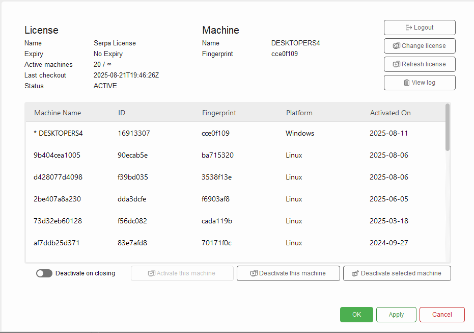

# OptimumG Application Test

The objective of this test is to create a screen using React that communicates with a C++ addon which manages the licenses of an application.

- The Frontend must be written in Javascript/Typescript and it must communicate with the backend written in C++.

- You can use libraries, such as Material UI, in order to have standardized components.

- The base project provided should run an example "Hello World" C++ function just to give an example of how the communication of the Frontend and Backend works.

- You are free to change any files already provided, remove or include functionalities.

- Basic OOP principles are expected to be followed in the backend.
    
    - Example: Single Responsibility Principle

- The use of git, such commit history, will be evaluated.

- Creating tests such as unit tests is not required, but can be a bonus
    
    - For Frontend tests we recommend using playwright


Extra: The Frontend can be based in the OptimumTire2 screen to manage the licenses, but this is not a requirement:

(the screenshot can be found in ./assets/OptimumTire2.png)




# Node.js Native Addon Project

This is a Node.js Native Addon project that can use C++ extensions in Node.js using N-API (Node API). Check: https://github.com/nodejs/node-addon-api

The base project includes a simple C++ function that can be called from JavaScript/TypeScript.

## Prerequisites

Before running this project, make sure you have the following installed:

- **Node.js** (v12 or higher)
- **npm** (comes with Node.js)
- **Python** (v3.6 or higher) - required by node-gyp
- **C++ compiler**:
  - **Windows**: Visual Studio 2017 or later (or Visual Studio Build Tools)
  - **macOS**: Xcode Command Line Tools
  - **Linux**: GCC/G++ compiler

## Installation

1. **Clone or download the project** to your local machine.

2. **Navigate to the project directory**:
   ```bash
   cd intern-test-napi
   ```

3. **Install dependencies**:
   ```bash
   npm install
   ```

## How to Run


### Method 1: Full Build and Run

If you need to rebuild the native addon (e.g., after making changes to C++ code):

1. **Build the native addon**:
   ```bash
   npx node-gyp rebuild
   ```

2. **Run the project**:
   ```bash
   node index.js
   ```


### Method 2: Quick Run

If the native addon is already built, you can run the project directly:

1. **Run the project**:
   ```bash
   node index.js
   ```

## Expected Output

When you run the base project successfully, you should see:
```
Hello from C++!
```

## Troubleshooting

### Common Issues

1. **Build Errors**: 
   - Make sure you have the correct C++ compiler installed
   - Ensure Python is installed and accessible from the command line
   - Try running `npm install --global node-gyp` if node-gyp is not found

2. **Permission Errors on Windows**:
   - Try running the command prompt as Administrator
   - Check that antivirus software isn't blocking the build process

## Development

### Adding New C++ Functions

1. Add your function to `src/backend/addon.cpp`
2. Export it in the `Init` function
3. Rebuild the addon with `npx node-gyp rebuild`
4. Update your TypeScript/JavaScript code to use the new function

### TypeScript Development

The TypeScript configuration is set up in `tsconfig.json`. You can modify the compilation settings there as needed.