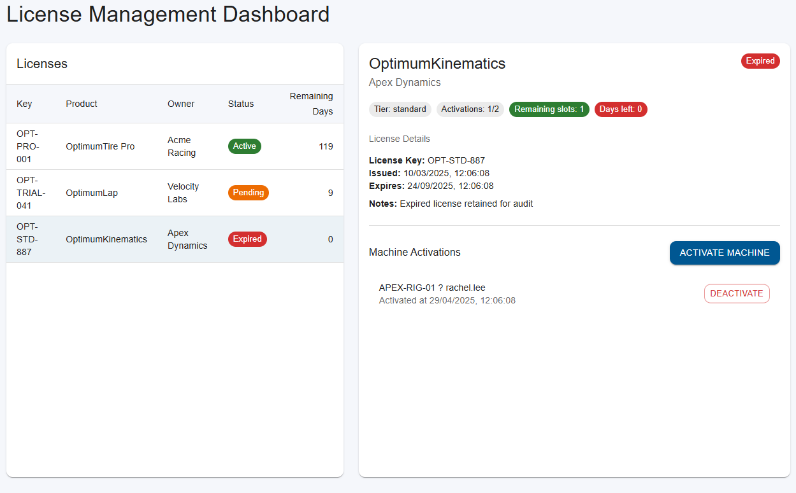

# License Management Dashboard

This project implements the OptimumG hiring challenge: a React dashboard that manages application licenses through a Node.js native addon written in C++ (N-API).

The solution is split into:
- **Native layer (C++)**  `src/backend/*.cpp` implements license domain logic and exposes it through the addon.
- **Node/TypeScript API**  `src/backend/index.ts` wraps the addon with typed helpers; `src/server` exposes REST endpoints.
- **React frontend** ? Vite + Material UI (`frontend/`) renders a license management UI consuming the REST API.

## Prerequisites

- Node.js 18+ (tested with v22.15.0)
- npm
- Python 3.6+
- C++ toolchain for `node-gyp`
  - Windows: Visual Studio Build Tools / Desktop development with C++
  - macOS: Xcode Command Line Tools
  - Linux: build-essential (gcc/g++)

## Project structure

```
 src/backend           # C++ addon implementation
 src/server            # Express REST API wrapping the addon
 frontend              # React + Vite application
 binding.gyp           # node-gyp build definition
 PLAN.md               # Planning notes & milestones
 README.md             # You are here
```

## Backend setup

Install dependencies and build the addon + TypeScript output:

```bash
npm install
npm run build              # node-gyp rebuild + tsc (outputs to dist/)
```

Run the REST API with hot reload (ts-node + nodemon):

```bash
npm run dev:server
```

or execute the compiled server:

```bash
npm start:server
```

### Available endpoints

Base URL defaults to `http://localhost:4000/api` (configurable via `PORT`).

| Method | Endpoint                              | Description                            |
| ------ | ------------------------------------- | -------------------------------------- |
| GET    | `/api/health`                         | Health check                           |
| GET    | `/api/licenses`                       | List all licenses                      |
| GET    | `/api/licenses/:key`                  | Fetch license details                  |
| POST   | `/api/licenses/:key/activate`         | Activate machine `{ machineId, activatedBy }` |
| POST   | `/api/licenses/:key/deactivate`       | Deactivate machine `{ machineId }`     |
| GET    | `/api/licenses/:key/status`           | Status snapshot (state + days left)    |

Each route returns `{ data: ... }` on success or `{ error: message }` with appropriate HTTP codes on failure.

## Frontend setup

The React application lives under `frontend/`.

```bash
cd frontend
npm install
cp .env.example .env   # optional, overrides VITE_API_BASE_URL
npm run dev            # starts Vite dev server (default http://localhost:5173)
```

Build for production:

```bash
npm run build
```

The UI mirrors the OptimumTire2 reference: license list on the left and details/activation controls on the right, including status chips, remaining days, and machine management dialogs.

## Development workflow

1. Ensure the native addon builds (`npm run build:addon`) after any C++ changes.
2. Run `npm run dev:server` to expose the API.
3. In another terminal, `npm run dev` inside `frontend/` to develop the UI with hot reload.
4. Commit frequently with descriptive messages (see git history for examples).

Manual test checklist:
- Activate a trial license and verify status transitions (pending, active).
- Deactivate a machine and confirm slots and status update.
- Attempt to activate beyond limit and confirm backend rejection.
- Observe remaining days and expired status for past-due licenses.

## Scripts reference

| Command | Location | Purpose |
| ------- | -------- | ------- |
| `npm run build:addon` | root | Rebuild native addon via node-gyp |
| `npm run build:backend` | root | Compile TypeScript backend to `dist/` |
| `npm run dev:server` | root | Start Express API with hot reload |
| `npm run start:server` | root | Run compiled Express API |
| `npm run build` | frontend | Production build (tsc + Vite) |
| `npm run dev` | frontend | Vite dev server |

## Notes

- All TypeScript types mirror the C++ domain objects so the frontend receives consistent data.
- The C++ layer maintains an in-memory repository with mock data but follows SRP to ease replacement with real persistence.
- React Query manages API state; Material UI provides styling for a professional look.
- See `PLAN.md` for architectural decisions and future enhancements.

## Manual validation

Core flows confirmed via REST calls (PowerShell) using an alternate port when 4000 was occupied:

```powershell
$env:PORT = 4001
npm run dev:server

Invoke-RestMethod -Uri "http://localhost:4001/api/licenses"
Invoke-RestMethod -Uri "http://localhost:4001/api/licenses/OPT-TRIAL-041/activate" -Method POST -Body '{"machineId":"QA-RIG-01","activatedBy":"qa"}' -ContentType 'application/json'
Invoke-RestMethod -Uri "http://localhost:4001/api/licenses/OPT-TRIAL-041/deactivate" -Method POST -Body '{"machineId":"QA-RIG-01"}' -ContentType 'application/json'
```

Frontend dev server executed with `.env` pointing `VITE_API_BASE_URL` to `http://localhost:4001/api`; activation/deactivation workflows reflected updates immediately (snackbars, table refresh).
### Automated tests

Run the Jest integration suite (compiles the native addon before executing):

```bash
npm test
```

## Screenshots




